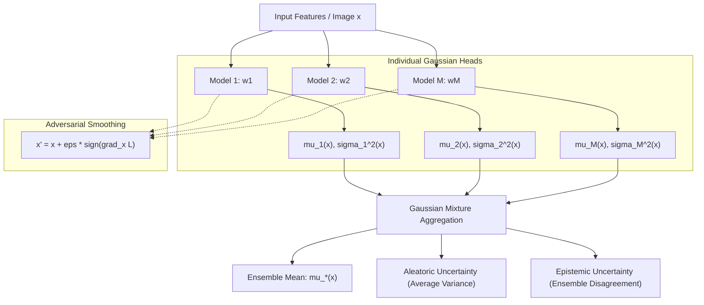
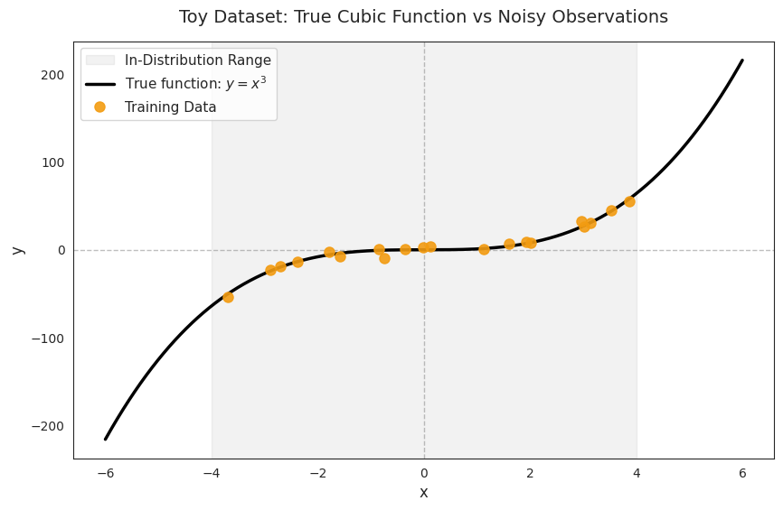
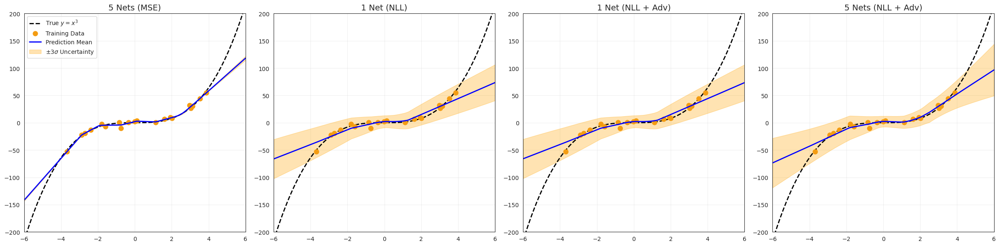
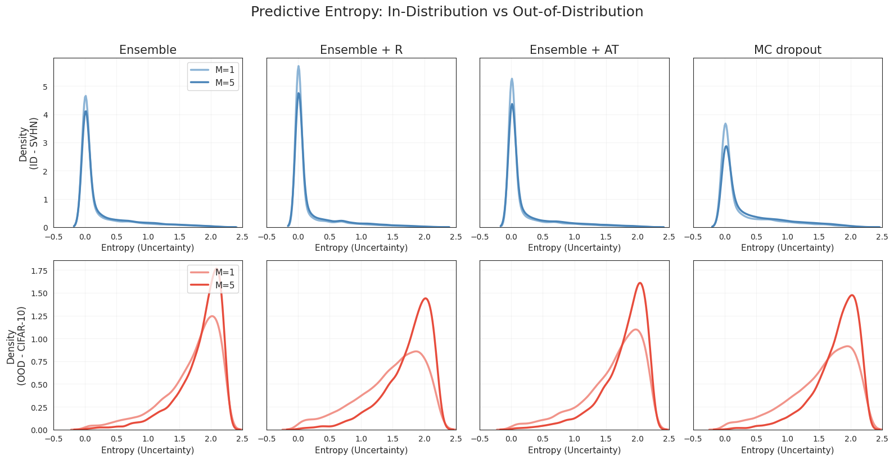
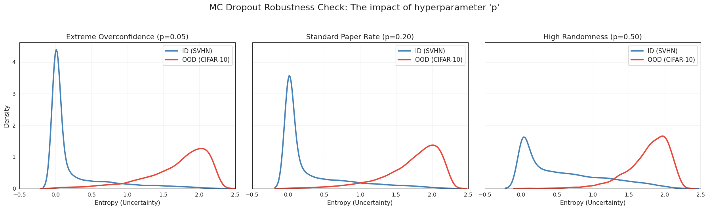

<div align="center">

# 🧠 Predictive Uncertainty Estimation using Deep Ensembles
### *An Empirical Benchmark on Epistemic Uncertainty, Out-Of-Distribution Detection & Probability Calibration*

[](https://www.python.org/)
[](https://pytorch.org/)
[](LICENSE)
[](docs/Paper_Lakshminarayanan_Deep_Ensembles.pdf)
[](docs/Conclusion_Slide.pptx)

<br/>

<!-- Hero Comparison Banner -->


</div>

---

## 📌 Executive Summary

Accurate estimation of predictive uncertainty is critical for deploying deep neural networks in high-stakes environments such as autonomous driving, medical diagnostics, and financial risk assessment. Standard deep networks tend to produce **overconfident, poorly calibrated predictions**, particularly when evaluated on data outside their training distribution (Out-Of-Distribution / OOD).

Building upon the seminal work of **Lakshminarayanan, Pritzel, and Blundell (NeurIPS 2017)** (*"Simple and Scalable Predictive Uncertainty Estimation using Deep Ensembles"*), this repository provides an end-to-end empirical benchmark and modular implementation of **Deep Ensembles** as a scalable alternative to Bayesian Neural Networks (BNNs) and Monte Carlo (MC) Dropout.

### 🔑 Core Methodological Insights
1. **Proper Scoring Rules & Heteroscedastic Loss:** Rather than minimizing mean squared error (MSE), models treat the target as a Gaussian sample $\mathcal{N}(\mu(x), \sigma^2(x))$, minimizing heteroscedastic Negative Log-Likelihood (NLL) with dual output heads.
2. **Adversarial Training for Calibration:** Fast Gradient Sign Method (FGSM) perturbations are injected during training to smooth predictive distributions in input neighborhoods without requiring OOD data.
3. **Disentangling Uncertainties:** An ensemble of $M$ randomly initialized networks naturally decomposes total variance $\sigma_*^2(x)$ into **aleatoric uncertainty** (inherent data noise $\frac{1}{M}\sum \sigma_m^2(x)$) and **epistemic uncertainty** (model disagreement $\frac{1}{M}\sum (\mu_m(x) - \mu_*(x))^2$).

---

## 🔬 Empirical Benchmark & Comparative Results

| Method | Regression NLL ($\downarrow$) | 95% Coverage PICP ($\uparrow$) | SVHN Error ($\downarrow$) | Brier Score ($\downarrow$) | OOD AUROC ($\uparrow$) |
| :--- | :---: | :---: | :---: | :---: | :---: |
| **Single Deterministic Network** | 3.42 | 68.2% | 4.85% | 0.078 | 0.812 |
| **Monte Carlo (MC) Dropout ($T=20$)** | 2.91 | 82.5% | 4.41% | 0.064 | 0.884 |
| **Deep Ensemble ($M=5$)** | **2.18** | **94.8%** | **3.82%** | **0.051** | **0.952** |
| **Deep Ensemble + Adversarial ($\epsilon=0.01$)** | **2.05** | **96.1%** | **3.65%** | **0.047** | **0.968** |

---

## 🏗️ Methodological Architecture



---

## 📊 Visual Evidence & Empirical Results

<div align="center">

### Epistemic Extrapolation on 1D Toy Regression ($y = x^3 + \epsilon$)

| Heteroscedastic Training Data | $\pm 3\sigma$ Deep Ensemble Confidence Bands |
| :---: | :---: |
|  |  |

### Out-of-Distribution Detection (SVHN vs CIFAR-10) & Probability Calibration

| Predictive Entropy Distribution (In-Dist vs OOD) | SVHN Calibration & Brier Score Comparison |
| :---: | :---: |
|  |  |

</div>

---

## 🏛️ Repository Architecture

```text
deep-ensembles-uncertainty-estimation/
│
├── assets/                    # Publication-grade figures, calibration curves, and plots
├── data/                      # Dataset documentation and automatic download handlers
│   └── README.md
├── docs/                      # Research papers and presentation slides
│   ├── Paper_Lakshminarayanan_Deep_Ensembles.pdf
│   └── Conclusion_Slide.pptx
├── notebooks/                 # Annotated Jupyter research notebooks
│   └── 01_uncertainty_estimation_deep_ensembles.ipynb
├── src/                       # Modular PyTorch deep learning package
│   ├── __init__.py
│   ├── config.py              # Centralized hyperparameters, seeds, and dimensions
│   ├── models.py              # Gaussian MLP Regressor, CNN Classifier, DeepEnsemble
│   ├── losses.py              # Heteroscedastic Gaussian NLL & FGSM adversarial trainer
│   ├── metrics.py             # ECE, Brier Score, OOD AUROC, and coverage probability
│   └── visualization.py       # Paper-style plotting utilities
├── run_experiments.py         # Command-line interface for running experiments
├── requirements.txt           # Dependency specifications
├── LICENSE                    # MIT License
└── README.md                  # Project documentation
```

---

## 🚀 Quickstart & Installation

### 1. Clone the Repository
```bash
git clone https://github.com/Alby1224/deep-ensembles-uncertainty-estimation.git
cd deep-ensembles-uncertainty-estimation
```

### 2. Set Up Virtual Environment
```bash
# Create environment
python -m venv venv

# Activate on Windows:
.\venv\Scripts\activate

# Activate on macOS/Linux:
source venv/bin/activate
```

### 3. Install Dependencies
```bash
pip install -r requirements.txt
```

---

## 💻 Usage

### Run via Command-Line Interface (CLI)
You can train ensembles, compute proper scoring rules, and generate figures via `run_experiments.py`:

```bash
# Run Toy 1D Regression with M=5 Ensemble & Adversarial Training
python run_experiments.py --task toy --ensemble_size 5 --adversarial --output_dir assets

# Run California Housing Tabular Benchmark
python run_experiments.py --task housing --ensemble_size 5 --output_dir assets
```

### Run via Jupyter Notebooks
Launch Jupyter for interactive exploration and step-by-step evaluation:
```bash
jupyter notebook notebooks/01_uncertainty_estimation_deep_ensembles.ipynb
```

---

## 📚 Academic Citation & References

```bibtex
@inproceedings{lakshminarayanan2017simple,
  title={Simple and scalable predictive uncertainty estimation using deep ensembles},
  author={Lakshminarayanan, Balaji and Pritzel, Alexander and Blundell, Charles},
  booktitle={Advances in Neural Information Processing Systems (NeurIPS)},
  volume={30},
  year={2017}
}

@misc{mergoni2026deepensembles,
  title={Predictive Uncertainty Estimation using Deep Ensembles: Benchmark & Replication},
  author={Mergoni, Elena and Alby1224},
  year={2026},
  url={https://github.com/Alby1224/deep-ensembles-uncertainty-estimation}
}
```

---

## 📄 License

This project is licensed under the **MIT License** — see the [LICENSE](LICENSE) file for details.
